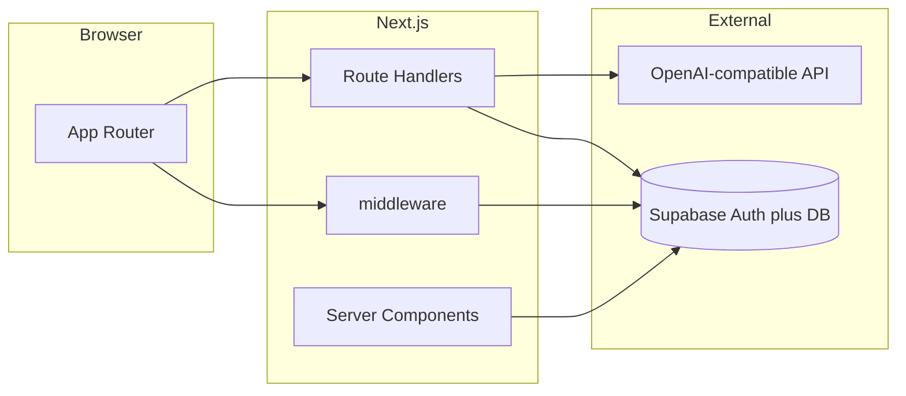
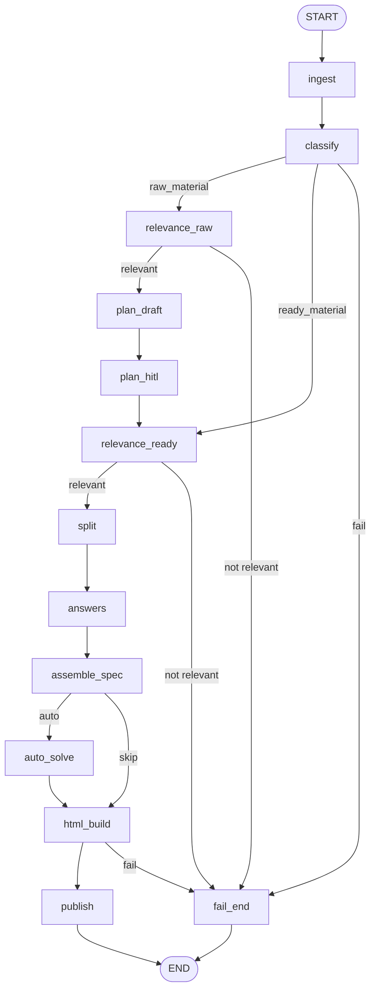

# Lingua-Bloom

Платформа для учителей и репетиторов: материал (текст или PDF) за пару минут превращается в интерактивный HTML-тест с помощью ИИ. Девиз — **«урок на раз-два»**.

Стек: **Next.js 16**, **LangGraph** ([`@langchain/langgraph-supervisor`](https://www.npmjs.com/package/@langchain/langgraph-supervisor) + worker-агенты), **OpenAI-совместимый LLM**, **Supabase** (Auth + Postgres).

## Функциональность

- **Создание теста в чате** — главная `/`: текст и/или PDF, таймлайн шагов пайплайна, HITL (план урока, эталонные ответы) — [`components/chat-run-workspace.tsx`](components/chat-run-workspace.tsx), API — [`app/api/runs/`](app/api/runs/).
- **История тестов** — список созданных уроков — [`app/history/page.tsx`](app/history/page.tsx).
- **Прохождение урока** — iframe с интерактивным HTML — [`app/learn/[id]/page.tsx`](app/learn/[id]/page.tsx).
- **Уведомления в Telegram** — после «Завершить тест» учителю уходит ФИО студента, баллы и ответы по вопросам; настройка в профиле — [`app/settings/telegram/page.tsx`](app/settings/telegram/page.tsx).
- **Регистрация и вход** — email/пароль и Google ([`app/auth/login`](app/auth/login), [`app/auth/sign-up`](app/auth/sign-up)); колбэк OAuth — [`app/auth/callback/route.ts`](app/auth/callback/route.ts).
- **Режим без авторизации** — `AUTH_DISABLED=1` для локальной разработки (записи под impersonate user id).

## Архитектура

| Слой | Назначение |
| ---- | ---------- |
| `app/` | App Router: страницы, layout; Route Handlers под `app/api/` |
| `middleware.ts` | Guard защищённых путей (при выключенном `AUTH_DISABLED`) |
| `components/` | Оболочка приложения, чат-workspace, shadcn/ui |
| `src/config/` | Типизированный доступ к env |
| `src/llm/` | OpenAI-совместимый клиент + structured output |
| `src/extract/` | Extract-first: PDF → текст, парсер готовых заданий (MCQ, gap, bracketGap), `detect-intent` |
| `src/agents/` | LLM-воркеры: classify (+ `materialIntent`), relevance, plan, split, validate, generate, solve |
| `src/supervisor/` | LangGraph supervisor: workers, router, run-executor, Postgres checkpointer |
| `src/lesson-spec/` | Zod-схема, normalize / coerce / prune / finalize, `map-candidates-to-spec`, `fidelity-check` |
| `src/html/` | Сборка и санация HTML урока |
| `src/db/` | Клиенты Supabase + runs / events / lessons / telegram settings |
| `src/telegram/` | Отправка результатов теста в Telegram Bot API |
| `src/auth/` | `AUTH_DISABLED` и сессия |
| `lib/` | UI-константы, утилиты auth |
| `public/lesson-runtime.js` | Клиентский рантайм интерактивного теста |
| `supabase/migrations/` | SQL: `lessons`, `lesson_generation_runs`, `lesson_generation_events` + RLS |



Поток **интерактивного урока**: клиент → `POST /api/runs` → LangGraph ([`src/supervisor/graph.ts`](src/supervisor/graph.ts)) → JSON-спека → `buildLessonHtmlFromSpec` → сохранение в Supabase → `/learn/[id]`. События прогона — `GET /api/runs/[id]/events`, продолжение после HITL — `POST /api/runs/[id]/resume`.

### Ключевые принципы

- **Supervisor + worker-агенты** — [`createSupervisor`](src/supervisor/graph.ts) координирует шаги пайплайна; маршрутизация детерминирована через `resolveNextHandoff`.
- **Extract-first** — если в материале уже есть задания, парсер извлекает их; на reproduce-пути LLM не добавляет новые вопросы.
- **`materialIntent`** — `reproduce_test` (готовый тест → только воспроизведение) vs `generate_from_content` (консервативная генерация по тексту).
- **Fidelity guard** — после сборки spec проверяется, что число вопросов и формулировки соответствуют извлечённым кандидатам ([`fidelity-check.ts`](src/lesson-spec/fidelity-check.ts)).
- **Один LLM-провайдер** — любой OpenAI-совместимый API через `OPENAI_BASE_URL` (OpenAI, Polza.ai, OpenRouter…).

### ИИ-агенты (LangGraph)



| Узел | Назначение | Файл |
| ---- | ---------- | ---- |
| `classify` | Pipeline (raw/ready) + intent (`reproduce_test` / `generate_from_content`) | [`src/agents/classify-material.ts`](src/agents/classify-material.ts), [`src/extract/detect-intent.ts`](src/extract/detect-intent.ts) |
| `relevance_*` | Релевантность для обучения | [`src/agents/check-relevance.ts`](src/agents/check-relevance.ts) |
| `plan_draft` / `plan_hitl` | Черновик плана + HITL | [`src/agents/draft-lesson-plan.ts`](src/agents/draft-lesson-plan.ts) |
| `split` | Разбиение на части | [`src/agents/split-parts.ts`](src/agents/split-parts.ts) |
| `answers` | HITL: эталон или авто-ответы | — |
| `assemble_spec` | Reproduce: mapper → finalize → fidelity; иначе generate | [`src/extract/candidates.ts`](src/extract/candidates.ts), [`src/lesson-spec/map-candidates-to-spec.ts`](src/lesson-spec/map-candidates-to-spec.ts), [`src/agents/validate-extracted.ts`](src/agents/validate-extracted.ts), [`src/agents/generate-spec.ts`](src/agents/generate-spec.ts) |
| `auto_solve` | Автоподбор эталонов | [`src/agents/solve-answers.ts`](src/agents/solve-answers.ts) |
| `html_build` / `publish` | HTML + сохранение (без LLM) | [`src/html/build-lesson-html.ts`](src/html/build-lesson-html.ts) |

**Human-in-the-loop:** `plan_hitl` — утверждение/правка плана; `answers` — ввод ключа ответов или авто-решение модели.

**Reproduce-путь (`materialIntent=reproduce_test`):** парсер извлекает нумерованные задания (MCQ, `___`, скобки `(to study)` / `(love)`); [`mapCandidatesToPartExercises`](src/lesson-spec/map-candidates-to-spec.ts) собирает spec без LLM; при сбое fidelity — fallback на `validateExtractedPart`, без `generatePartExercises`.

**Generate-путь:** только если готовых заданий нет — минимум вопросов, один доминирующий `inputKind` на часть.

Модели по ролям: `OPENAI_MODEL` (базовая), опционально `OPENAI_MODEL_CLASSIFY`, `OPENAI_MODEL_PLAN`, `OPENAI_MODEL_SPEC` (алиасы `POLZA_*` тоже читаются).

## Безопасность

- **Защита маршрутов**: `/`, `/history`, `/learn`, `/upload` требуют сессии, если `AUTH_DISABLED` выключен — [`middleware.ts`](middleware.ts).
- **RLS**: политики `auth.uid() = user_id` для `lessons` и runs; events — через владельца run — [`supabase/migrations/0001_init.sql`](supabase/migrations/0001_init.sql).
- **Пользовательский HTML**: санация перед выдачей — [`src/html/sanitize.ts`](src/html/sanitize.ts); рантайм — [`public/lesson-runtime.js`](public/lesson-runtime.js).
- **Open redirect**: после логина только внутренний путь — [`lib/auth/safe-next-path.ts`](lib/auth/safe-next-path.ts).
- **Ограничения**: на AI-эндпоинтах нет встроенного rate limiting; при публичном деплое стоит добавить лимиты.

## Данные (Supabase)

Таблицы в миграции [`0001_init.sql`](supabase/migrations/0001_init.sql):

| Таблица | Назначение |
| ------ | ---------- |
| `lessons` | Готовый урок: title, source_type, html_body, spec_json, meta |
| `lesson_generation_runs` | Прогон пайплайна: status, phase, mode, thread_id, payload |
| `lesson_generation_events` | Append-only лог шагов для UI |
| `user_telegram_settings` | Персональные Bot Token и Chat ID учителя для уведомлений |

LangGraph checkpointer создаёт свои таблицы через `PostgresSaver.setup()` (нужен `SUPABASE_DB_URL`).

Миграция Telegram: [`20260731120000_user_telegram_settings.sql`](supabase/migrations/20260731120000_user_telegram_settings.sql).

## Telegram: результаты тестов

Когда студент нажимает **«Завершить тест и показать результаты»**, приложение отправляет учителю сообщение в Telegram:

- название теста;
- ФИО студента;
- баллы;
- ответы по каждому вопросу (✅/❌ и верные ответы для ошибок).

### Настройка (для учителя)

1. Откройте **Настройки профиля** в шапке (`/settings/telegram`).
2. Создайте бота через [@BotFather](https://t.me/BotFather) (`/newbot`) и скопируйте **Bot Token**.
3. Напишите боту `/start` в личные сообщения.
4. Узнайте свой **Chat ID** (например, через [@userinfobot](https://t.me/userinfobot)).
5. Заполните форму, нажмите **Сохранить**, затем **Отправить тест** для проверки.

Токен бота хранится в Supabase и **не показывается** повторно в интерфейсе (только флаг «сохранён»).

### Технически

| Компонент | Путь |
| --------- | ---- |
| Страница настроек | [`app/settings/telegram/page.tsx`](app/settings/telegram/page.tsx) |
| API сохранения | `GET/PUT /api/settings/telegram` |
| API тестового сообщения | `POST /api/settings/telegram/test` |
| Отправка после теста | `POST /api/lessons/:id/submit-results` ← [`public/lesson-runtime.js`](public/lesson-runtime.js) |
| Хранение credentials | [`src/db/telegram-settings.ts`](src/db/telegram-settings.ts) |

Перед первым использованием примените миграцию `user_telegram_settings` в Supabase.

Опционально для локальной разработки можно задать fallback в `.env`:

```bash
TELEGRAM_BOT_TOKEN=
TELEGRAM_CHAT_ID=
```

Если у учителя нет записи в профиле, но переменные заданы на сервере, они используются как запасной вариант.

## Переменные окружения

См. [`.env.example`](.env.example) и [`.env.production.example`](.env.production.example).

| Переменная | Назначение |
| ---------- | ---------- |
| `OPENAI_API_KEY` / `OPENAI_BASE_URL` / `OPENAI_MODEL` | OpenAI-совместимый LLM |
| `OPENAI_MODEL_CLASSIFY` / `_PLAN` / `_SPEC` | Опциональные модели по ролям |
| `NEXT_PUBLIC_SUPABASE_URL` / `NEXT_PUBLIC_SUPABASE_ANON_KEY` | Клиент Supabase |
| `SUPABASE_SERVICE_ROLE_KEY` | Серверные записи в обход RLS |
| `SUPABASE_DB_URL` | Postgres для LangGraph checkpointer |
| `AUTH_DISABLED` | `1` — без логина (только локально) |
| `AUTH_DISABLED_IMPERSONATE_USER_ID` | UUID пользователя при `AUTH_DISABLED` |
| `NEXT_PUBLIC_APP_URL` | Origin для OAuth / post-auth redirects |
| `TELEGRAM_BOT_TOKEN` / `TELEGRAM_CHAT_ID` | Опциональный fallback, если учитель не настроил профиль |
| `LANGSMITH_TRACING` / `LANGSMITH_API_KEY` / `LANGSMITH_PROJECT` | Опциональный трейсинг LangGraph в [LangSmith](https://smith.langchain.com) |
| `LANGCHAIN_CALLBACKS_BACKGROUND` | Для Next.js обычно `false`, чтобы трейс успел отправиться |

### LangSmith

При `LANGSMITH_TRACING=true` и заданном `LANGSMITH_API_KEY` каждый прогон генерации (API и `pnpm test:e2e`) отправляет трейс в LangSmith: промпты/ответы LLM-узлов, metadata `runId` / `threadId`. Отдельный пакет ставить не нужно — трейсинг встроен в `@langchain/core`.

В Supabase → Authentication → URL Configuration добавьте Redirect URL вида `{NEXT_PUBLIC_APP_URL}/auth/callback`.

## Локальный запуск

Требуются **Node.js 22+** (рекомендуется) и **pnpm** (версия в `package.json`).

```bash
pnpm install
cp .env.example .env   # заполнить OPENAI_* и SUPABASE_*

# Применить миграцию в SQL Editor Supabase или через CLI:
# supabase db push

pnpm dev               # http://localhost:3000/
```

По умолчанию `AUTH_DISABLED=1` — авторизация выключена.

## Production

```bash
docker compose build app
docker compose up
```

`Dockerfile` собирает standalone-бандл Next.js; БД — внешний Supabase. В prod задайте `AUTH_DISABLED=0` и `NEXT_PUBLIC_APP_URL` на боевой origin.

## Скрипты

| Команда | Описание |
| ------- | -------- |
| `pnpm dev` | Dev-сервер Next.js |
| `pnpm build` / `pnpm start` | Production-сборка и запуск |
| `pnpm test` | Vitest: extract, detect-intent, map-candidates, fidelity-check, finalize (без сети) |
| `pnpm test:e2e` | Живой прогон supervisor через LLM (`tesing-data/`); проверка reproduce-пути |
| `pnpm typecheck` | `tsc --noEmit` |
| `pnpm lint` | Next.js ESLint |

## Тесты

```bash
pnpm test        # детерминированные unit/integration
pnpm test:e2e    # полный supervisor на реальных данных; skip без API-ключа
```

Покрытие: парсер `extractCandidates` (MCQ, gap, bracketGap, inline-нумерация), `detect-intent`, детерминированный mapper, fidelity guard, PDF из `tesing-data/`, e2e reproduce (PDF + `raw.txt`) и генерация с HITL.

Конфиг: [`vitest.config.ts`](vitest.config.ts); `.env` подхватывается в [`test/setup.ts`](test/setup.ts).

---

## English summary

Lingua-Bloom helps **teachers and tutors** turn text or PDF into an interactive HTML quiz in minutes («урок на раз-два»). Next.js 16 app with a **LangGraph supervisor** pipeline (`@langchain/langgraph-supervisor`, `src/supervisor/graph.ts`), **extract-first** parsing with **reproduce vs generate** intent, fidelity checks, OpenAI-compatible LLMs, and **Supabase** (Auth + RLS). HITL pauses cover lesson-plan approval and answer keys. **Telegram**: per-teacher bot settings at `/settings/telegram`; test results are pushed when a student finishes a lesson.
